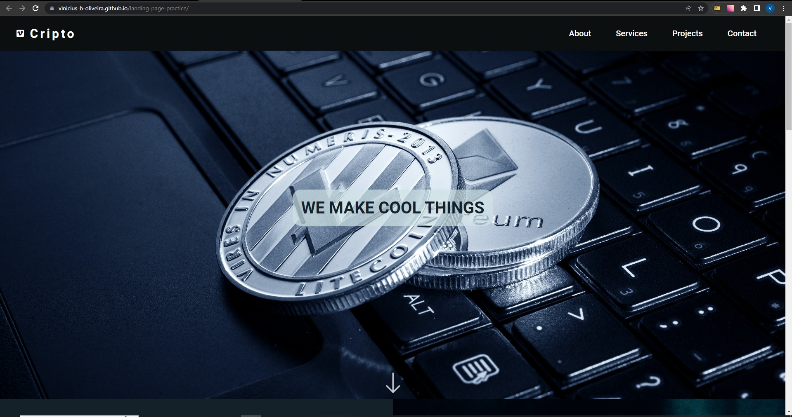

# Landing Page

## Sumário

- [Visão Geral](#visão-geral)
  - [Desafio](#desafio)
  - [Print](#print)
  - [Links](#links)
- [Meu processo](#meu-processo)
  - [Tecnologias](#tecnologias)
  - [Pratica de Aprendizado](#pratica-de-aprendizado)
  - [Habilidades em Desenvolvimento](#habilidades-em-desenvolvimento)
- [Autor](#autor)
- [Agradecimentos](#agradecimentos)

## Visão Geral

### Desafio

- Acompanhar o desenvolvimento do projeto e ao fim customiza-lo segundo o meu gosto. 

### Print



### Links

- Projeto: [Ir para projeto](https://vinicius-b-oliveira.github.io/landing-page-practice/)

## Meu Processo

### Tecnologias

- Marcação semantica com HTML 5
- Folhas de estilo em cascata no CSS 3
- Estilos flexiveis usando CSS Flexbox
- Layouts responsivos usando CSS Grid
- Animações usando CSS
- Armazenamento de propriedades usando variáveis CSS
- Git para versionamento de código

### Pratica de Aprendizado

Esse projeto proporcionou a prática de diversos conceitos importantes, tanto do HTML (a exemplo, tem-se as tags semânticas) quanto do CSS (no caso do Flex Box e Grid). Além disso, foi possível aprender uma forma de criar um menu Hamburguer para resoluções pequenas de tela usando somente CSS. 

```css
.header .header-container {
    display: flex;
    padding: 20px 40px;
    justify-content: space-between;
    align-items: center;
    min-height: 75px;
}

.header .hamburguer::before, .header .hamburguer::after {
    background-color: #ffffff;
    content: "";
    display: block;
    width: 100%;
    height: 100%;
    position: absolute;
    transition: 0.2s ease-in-out;
}
```

### Habilidades em Desenvolvimento

Com o passar do tempo, vem se tornando cada vez mais necessário e obrigatório a criação de layouts de sites responsivos. Por este motivo, planejo desenvolver cada vez mais essa minha habilidade, e com esse projeto foi possível avançar mais um grande passo através do menu hamburguer, recurso muito importante no quesito responsividade. 

## Autor

- Github - [Vinicíus Bueno](https://github.com/Vinicius-b-oliveira)

## Agradecimentos

Projeto realizado durante o curso de programação [Dev Quest](https://devemdobro.com/matriculas-abertas/) sobre mentoria dos gêmeos Ricardo Dias e Roberto Dias. 
